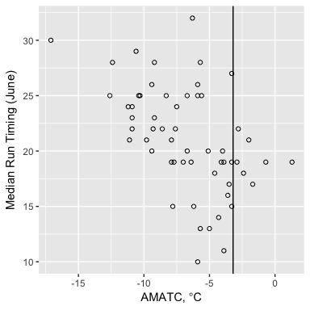

Data Aquisition
---------------

The 2018 value of AMATC was retrieved using the
[rnoaa](https://github.com/ropensci/rnoaa) R package which uses the
[NOAA CDO](https://www.ncdc.noaa.gov/cdo-web/) API. The daily values of
average daily temperature (TAVG) were averaged together to calculate
AMATC. This isn’t necessarily how NOAA calculates average monthly
temperatures but this gets us access to the value earlier and tends to
be close enough to the final monthly average temperature to not affect
our results.

Graphical Analysis
------------------

How does the 2018 value of AMATC, -7.3, compare to the historical data?

**Intepretation:** An AMATC of -7.3 C is just about in the middle of the
historical range for this variable so we should expect an average run
timing.

Forecast
--------

To forecast MDJ for 2018, I followed the approach as in previous years.

I fit a simple linear model of AMATC vs. MDJ using 55 years (1961 –
2017) of historical AMATC and MDJ. I then predicted the 2018 MDJ using
the fitted model which came out to be **June 21**.

### Hindcasting

As with the full forecast and previous years, I used a hindcasting
approach (one-step-ahead cross-validation) to get a sense of how well
AMATC predicts MDJ.

I hindcasted MDJ using an arbitrary window of 2003 – 2017 (n=15) using
the same AMATC vs. MDJ model as above and calculated the following three
metrics:

<table>
<thead>
<tr class="header">
<th>Metric</th>
<th>Value (days)</th>
</tr>
</thead>
<tbody>
<tr class="odd">
<td>Mean absolute devitation</td>
<td>3.93</td>
</tr>
<tr class="even">
<td>Standard deviation of absolute deviations</td>
<td>3.06</td>
</tr>
<tr class="odd">
<td>Maximum absolute residual</td>
<td>12</td>
</tr>
<tr class="even">
<td>Mean deviation</td>
<td>-4</td>
</tr>
</tbody>
</table>

Predicted values of MDJ were rounded down to the nearest day because MDJ
is recorded at daily time steps.

**Interpretation**: The AMATC-only model is a lot less useful than the
full model and tends to generate predictions that are four days off the
true MDJ and tend to be biased 4 days early.
