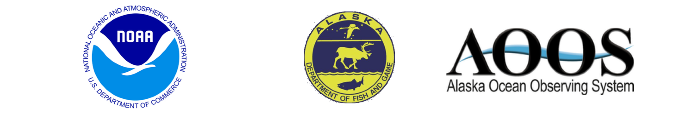

Tuesday, June 5, 2018

## Run Timing Prospects for 2018

The 2018 timing for Yukon River Chinook is expected to be slightly
earlier than average. The first significant pulse (15% point) of Chinook
in the lower river is expected on June 9, which is earlier than the
long-term average of June 13 (1961 – 2017). The half-way point (50%) of
the run is expected on June 17, which is also earlier than the long-term
average of June 21 (1961 – 2017). The April mean air temperature at Nome
this year of -3.2°C was warmer than the long-term average of -6.8°C
(1961 – 2017). The May mean sea surface temperature as modeled just off
the Yukon River delta (63.18°N 165.58°W) of -0.2°C was warmer than the
long-term average of -0.4°C (1961 – 2017). In keeping with the early
spring conditions in northwestern Alaska, the Spring (March 19 – May 31)
sea ice coverage was 11.85%, which is very far outside the experience of
the historical database (1970 – 2017), which has a long-term average of
56.27%, as measured in the waters between the Yukon River delta and
St. Lawrence Island (Shpanberg Strait).

## Run Timing Forecast by Date 2018

Based on the relationship between the dates of the three percentiles
(15%, 25%, and 50%) and the sea ice coverage and the air and sea surface
temperatures, the predicted dates of the three percentiles are June 9
(15%), June 11 (25%), and June 17 (50%) in District Y-1 of the Lower
Yukon River.

| Percentile (%) | Predicted Date |
| -------------- | -------------- |
| 15             | June 9         |
| 25             | June 11        |
| 50             | June 17        |

See [the project
website](http://www.aoos.org/2018-run-timing-outlook-and-forecast-summary-chinook-salmon-yukon-river-delta/)
for comparisons of the estimated daily percentages of the run to results
of the 2018 Lower Yukon Test Fishery and past years’ test fisheries. If
the current timing model doesn’t match reality, the forecast dates will
be updated and posted on the web site.

## Credits

Prepared and reviewed by Bryce Mecum <brycemecum@gmail.com>, Phil Mundy
<proymundy@gmail.com>, and Jordan Watson <jordan.watson@noaa.gov>. Data
management and web page support by Will Koeppen <will@axiomalaska.com>.
Web support also provided by Holly Kent
[kent@aoos.org](mailto:%20kent@aoos.org). Yukon Chinook in-season salmon
data and management agency coordination by Fred West
<fred.west@alaska.gov>, Sean Larson <sean.larson@alaska.gov>, and Holly
Carroll <holly.carroll@alaska.gov>. Financial and material supports were
provided by the Alaska Ocean Observing System, NOAA National Marine
Fisheries Service, and the Alaska Department of Fish and Game.
