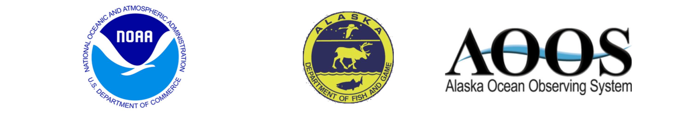

```{r include=FALSE}
library(lubridate)
```

`r strftime(now(), format = "%A, %B %e, %Y")`

\begin{center}
  \huge{Postseason Analysis of the 2018 Yukon River Chinook Run Timing Forecast}
\end{center}


The 2018 season gave us a completely new experience; producing a forecast during a spring that was virtually sea ice free. Between unusually warm Bering Sea climate and mother nature making inseason run assessment more challenging than usual, 2018 certainly made for an interesting forecast year. Starting with the early look forecast in May 7, we were expecting a slightly early run due to the slightly warmer-than-average April mean air temperature at Nome of -3.2°C (long-term average -6.8°C; range -17.1°C - 1.3°C). By the final pre-season forecast on June 5, we were seeing a similarly warm May mean sea surface temperature in the nominal staging area of -0.2°C (long-term average -0.4°C; range -3.8°C - 2.8°C) but an all-time low sea ice cover (over the same area) of 11.85% (previous long-term average 56.27%; range 23% - 78%). Due to spring sea ice conditions outside the range previously observed during 1970 - 2017, we entered the 2018 forecast year with extra caution.

On June 5th, we delivered the [final pre-season run timing forecast](http://www.aoos.org/wp-content/uploads/2018/06/2018_yukon_chinook_timing_forecast.pdf) via our [AOOS project page](https://www.aoos.org/2018-run-timing-outlook-and-forecast-summary-chinook-salmon-yukon-river-delta/) and via email, predicting the first significant pulse (15% point) of Chinook salmon would enter the Yukon River delta on June 9th. We also predicted that half of the the run would have entered the delta by June 17th. Due to high water and debris, ADFG was unable to bring the Lower Yukon Test Fishery fully online so, without our usual inseason data streams to provide early feedback on the run timing model, we decided to make use of the Big Eddy drift net site that ADFG has run in recent years in order to give managers an early look during the first few weeks of the run. 

On June 19th, due to a poor fit between the pre-season run timing model and the inseason catch data at Big Eddy drift, we issued a refit of the original, pre-season run timing model which resulted in a new 50% point of June 22 (5 days later than we predicted in-season). As the season continued, the fit between the refit run timing model and the in-season Big Eddy drift catches continued to diminish. Instead of issuing another refit, we finished the 2018 season with the refit model and reanalyzed model performance again after the end of the run.

The final 50% point at LYTF was June 23, which is one day later than the refit run timing model’s prediction of June 22. All things considered, our pre-season run timing forecast was 6 days early but our refitting process honed in on a more accurate prediction before the 50% point was achieved, which counts as a success.

The new experience of producing a forecast during a spring that was virtually sea ice free taught valuable lessons and confirmed earlier expectations about how salmon run timing would respond to climate change. In an earlier [publication](https://academic.oup.com/icesjms/article/68/6/1155/714627) (2011) the warmer conditions associated with climate change were expected to eventually increase variability in the migratory timing of Yukon Chinook, making forecasting more difficult. In particular the absence of spring sea ice was expected to increase the importance of other environmental drivers not presently in the model, such as wind-forced mixing of the water column, while decreasing the importance of the current drivers. These expectations were realized in 2018 when, for the first time in our operational forecasting experience the [qualitative initial prospects](http://www.aoos.org/wp-content/uploads/2018/05/2018-Initial-Prospects-Yukon-River-Chinook-Timing-Final-Version.pdf) issued early in the season (2018/07/05) called for an early run, when the run turned out to be late. The [quantitative forecast](http://www.aoos.org/wp-content/uploads/2018/06/2018_yukon_chinook_timing_forecast.pdf) issued later (2018/06/06) also underestimated the timing dates of the 2018 run.  Developing forecast models is a dynamic process that requires some prospecting among likely environmental variables to identify a set of drivers best suited to the ice-free springs that are expected to become increasingly common as global warming progresses.

## Credits

Prepared and reviewed by Bryce Mecum [brycemecum@gmail.com](mailto:brycemecum@gmail.com), Phil Mundy [proymundy@gmail.com](mailto:proymundy@gmail.com), and Jordan Watson [jordan.watson@noaa.gov](mailto:jordan.watson@noaa.gov). Data management and web page support by Will Koeppen [will@axiomalaska.com](mailto:will@axiomalaska.com). Web support also provided by Holly Kent [kent@aoos.org](mailto: kent@aoos.org). Yukon Chinook in-season salmon data and management agency coordination by Fred West fred.west@alaska.gov, Sean Larson [sean.larson@alaska.gov](mailto:sean.larson@alaska.gov), and Holly Carroll [holly.carroll@alaska.gov](mailto:holly.carroll@alaska.gov).  Financial and material supports were provided by the Alaska Ocean Observing System, NOAA National Marine Fisheries Service, and the Alaska Department of Fish and Game.